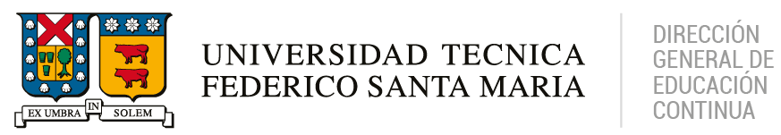

  

# Semana 01

## Contenidos de la semana

| Archivo | Descripción |
|--------|-------------|
| [material_semanal.md](./a_material_semanal.md) | Material de estudio teórico de la semana |
| [infograma.md](./b_infograma.md) | Infografía o esquema visual de apoyo |
| [cuestionario.md](./c_cuestionario.md) | Cuestionario de autoevaluación |
| [actividad.md](./d_actividad.md) | Actividad práctica o aplicada |
