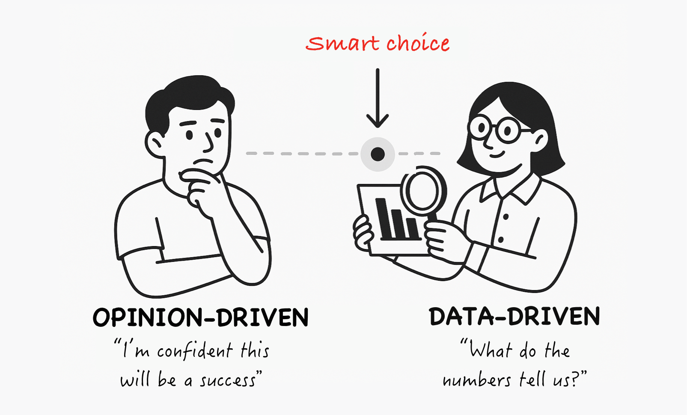
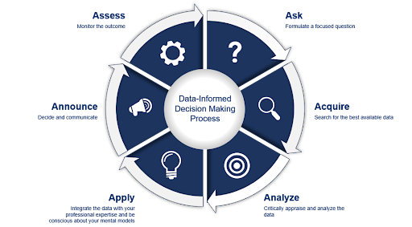
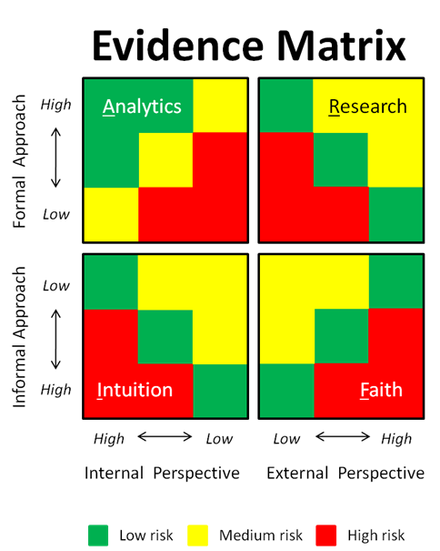
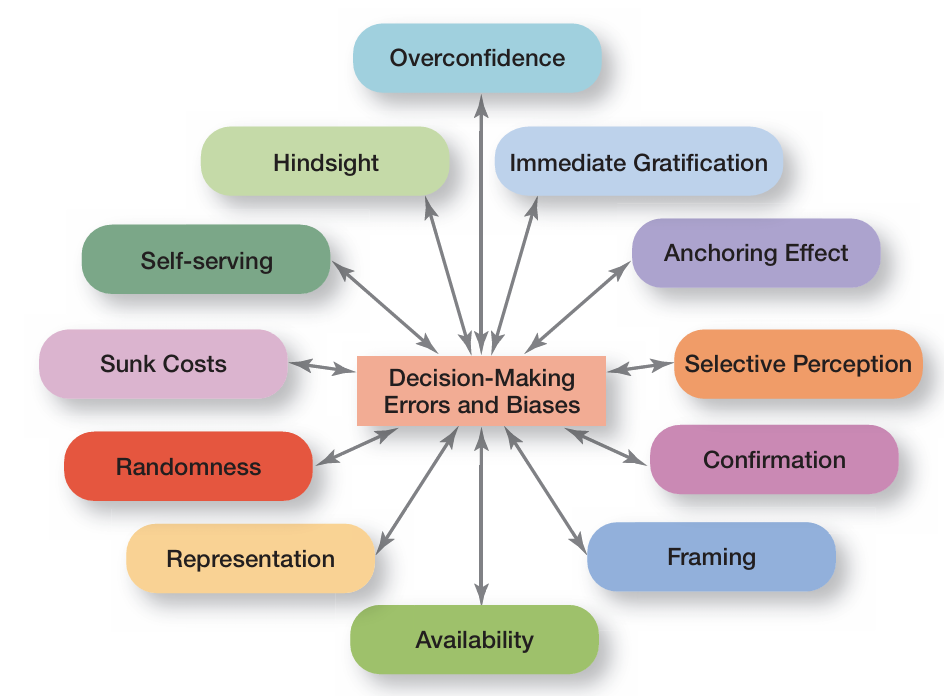
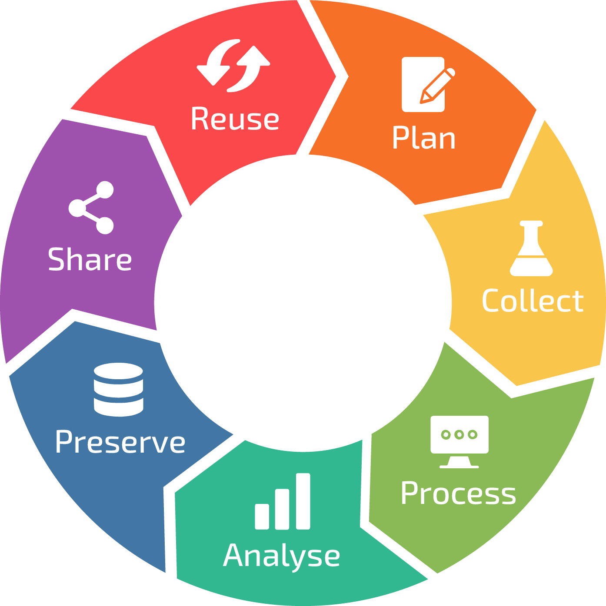
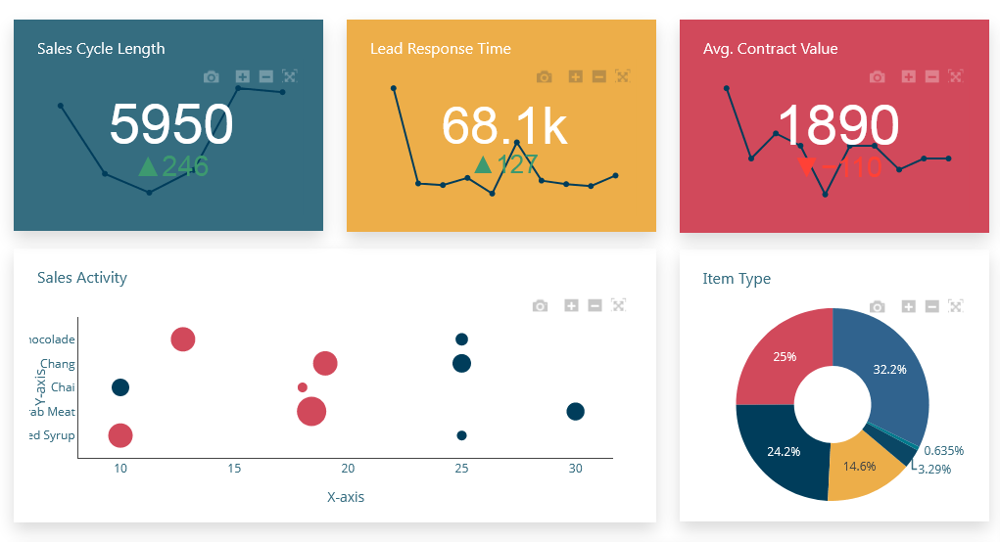

# Fundamentos de la Toma de Decisiones Basadas en Datos

## INTRODUCCIÓN

La toma de decisiones es una actividad central en toda organización, tanto en el ámbito público como privado. Directivos, profesionales y equipos de trabajo deben decidir de manera constante en contextos caracterizados por **incertidumbre**, **presión por resultados** y **limitaciones de información**.

Tradicionalmente, muchas decisiones han sido guiadas por la experiencia, la intuición o el criterio personal. Si bien estos elementos siguen siendo relevantes, el crecimiento en la disponibilidad de datos y herramientas de análisis ha transformado la forma en que las organizaciones enfrentan sus desafíos. En este contexto, la **toma de decisiones basadas en datos** surge como un enfoque que busca **reducir la incertidumbre**, **mejorar la justificación de las decisiones** y **aprender sistemáticamente de los resultados obtenidos**.

Decidir con datos no implica delegar la decisión a los números, sino integrar evidencia confiable al proceso de análisis, permitiendo evaluar alternativas, anticipar riesgos y comunicar decisiones de manera transparente y fundamentada.

## 1. CONTEXTO DE LA TOMA DE DECISIONES EN ORGANIZACIONES

Las organizaciones operan en entornos dinámicos donde los cambios tecnológicos, económicos y sociales influyen directamente en su desempeño. En este escenario, la toma de decisiones se vuelve un proceso estratégico que impacta en la eficiencia, la sostenibilidad y la competitividad institucional.

Decidir implica seleccionar una alternativa entre varias posibles, asumiendo que ninguna decisión se toma con información completa. Los datos permiten **reducir el grado de incertidumbre**, identificar patrones relevantes y evaluar escenarios futuros, pero no eliminan completamente el riesgo asociado a decidir.

En este sentido, el enfoque basado en datos busca fortalecer la calidad del proceso decisional, entregando herramientas que apoyen el análisis y la reflexión, sin reemplazar el juicio humano ni la responsabilidad de quienes toman decisiones.

## 2. INTUICIÓN Y EVIDENCIA: DOS FORMAS DE DECIDIR

La intuición es una forma natural de decidir, construida a partir de la experiencia, el conocimiento tácito y la observación acumulada. En muchos contextos, permite reaccionar con rapidez y eficacia. Sin embargo, también puede verse afectada por **sesgos cognitivos**, percepciones parciales o experiencias aisladas.

La evidencia basada en datos permite complementar la intuición, proporcionando información verificable, analizable y comunicable. A través del uso sistemático de datos, es posible contrastar supuestos, validar hipótesis y fundamentar decisiones frente a distintos actores.

| Intuición                                | Evidencia                        |
| ---------------------------------------- | -------------------------------- |
| Subjetiva                                | Analizable                       |
| Difícil de justificar                    | Trazable                         |
| Dependiente de la experiencia individual | Replicable                       |
| Vulnerable a sesgos                      | Basada en información observable |

El desafío no consiste en elegir entre intuición o datos, sino en **integrar ambos enfoques de manera equilibrada**.

## 3. ERRORES FRECUENTES AL DECIDIR SIN DATOS

Decidir sin una base de información adecuada puede conducir a errores que afectan el desempeño organizacional. Entre los más comunes se encuentran:

* Sesgo de confirmación: buscar solo información que valide una creencia previa.
* Generalización a partir de casos aislados.
* Uso de métricas mal definidas o irrelevantes.
* Interpretación de datos sin contexto.
* Exceso de información sin análisis claro.

Es importante destacar que **disponer de grandes volúmenes de datos no garantiza mejores decisiones**. La calidad, pertinencia y correcta interpretación de la información son factores determinantes.

## 4. EL CICLO DE LOS DATOS EN LA TOMA DE DECISIONES

La toma de decisiones basada en datos puede entenderse como un ciclo continuo que permite aprender y mejorar con el tiempo. Este ciclo incluye las siguientes etapas:

1. Recolección de datos relevantes.
2. Procesamiento y limpieza de la información.
3. Análisis e interpretación.
4. Visualización y comunicación de resultados.
5. Toma de decisiones y evaluación de resultados.

Este ciclo refuerza la idea de que las decisiones no son eventos aislados, sino procesos que se retroalimentan continuamente.

## 5. INDICADORES Y MÉTRICAS PARA DECIDIR

Los indicadores permiten transformar datos en información útil para la toma de decisiones. No todas las métricas tienen el mismo valor estratégico. Algunas apoyan decisiones de largo plazo, mientras que otras permiten monitorear la operación diaria.

Se pueden distinguir, entre otros:

* Indicadores estratégicos y operativos.
* Indicadores predictivos (leading) y reactivos (lagging).
* Métricas relevantes versus métricas vanidosas.

Un principio clave es que **una métrica que no influye en una decisión concreta carece de utilidad práctica**.

## CONCLUSIONES

La toma de decisiones en contextos organizacionales constituye un proceso complejo, influido por la incertidumbre, la disponibilidad de información y la presión por resultados. En este escenario, el uso de datos se presenta como un elemento clave para fortalecer la calidad del análisis y reducir los riesgos asociados a decidir sin evidencia suficiente.

A lo largo de esta semana se ha abordado el rol de los datos como apoyo al proceso decisional, destacando la importancia de diferenciar la intuición de la evidencia, reconocer los errores más comunes al decidir sin información confiable y comprender el ciclo mediante el cual los datos se transforman en insumos para la acción. Este enfoque permite transitar desde decisiones basadas exclusivamente en percepciones hacia decisiones más justificadas, trazables y comunicables.

Asimismo, se ha enfatizado que el uso de datos no reemplaza el juicio humano ni la responsabilidad de quienes deciden. Por el contrario, los datos deben integrarse de manera crítica y contextualizada, considerando el propósito de la decisión, la calidad de la información disponible y las consecuencias organizacionales de su aplicación.

Comprender los fundamentos de la toma de decisiones basadas en datos constituye un primer paso para desarrollar capacidades analíticas más avanzadas. Este conocimiento sienta las bases para interpretar información, comunicar hallazgos y evaluar, en etapas posteriores, el rol de la analítica y la inteligencia artificial en procesos decisionales más complejos.

## BIBLIOGRAFÍA BASE

* Davenport, T. H., & Harris, J. G. (2007). *Competing on Analytics: The New Science of Winning*. Harvard Business School Press.

  > Referente clásico sobre cómo las organizaciones usan datos para decidir mejor.

* Provost, F., & Fawcett, T. (2013). *Data Science for Business*. O’Reilly Media.

  > Enfoque conceptual sobre el valor de los datos en la toma de decisiones empresariales.

* Kahneman, D. (2011). *Thinking, Fast and Slow*. Farrar, Straus and Giroux.

  > Base teórica fundamental para comprender intuición, sesgos y toma de decisiones.

* McAfee, A., & Brynjolfsson, E. (2012). *Big Data: The Management Revolution*. Harvard Business Review.

  > Discusión estratégica sobre el impacto de los datos en la gestión organizacional.

* OECD. (2019). *Enhancing Access to and Sharing of Data*. OECD Publishing.

  > Marco institucional sobre uso responsable y estratégico de datos.

* Ministerio de Ciencia, Tecnología, Conocimiento e Innovación de Chile. (2021). *Política Nacional de Inteligencia Artificial*.

  > Contexto normativo y estratégico nacional sobre datos e IA.

* Few, S. (2012). *Show Me the Numbers: Designing Tables and Graphs to Enlighten*. Analytics Press.

  > Referencia clave para comprender cómo los datos apoyan decisiones a través de información clara.

