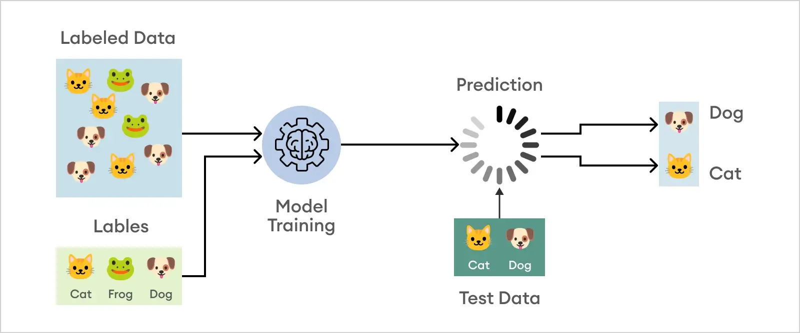
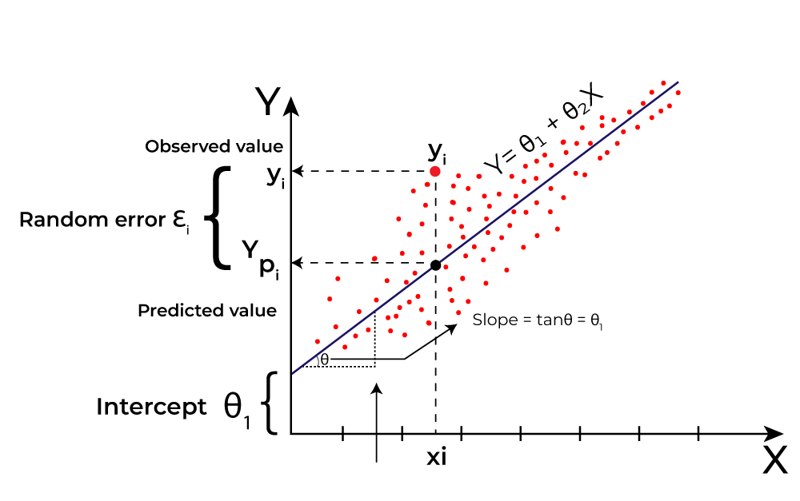
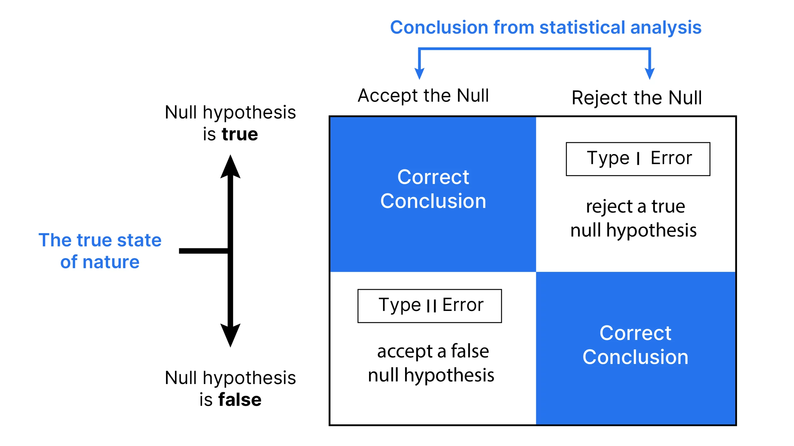

# Modelos Predictivos para la Toma de Decisiones Organizacionales

## INTRODUCCIÓN

En la semana anterior se abordaron los fundamentos de la toma de decisiones basadas en datos, destacando el rol de la evidencia como apoyo para reducir la incertidumbre y mejorar la calidad del análisis. En este contexto, los datos permiten comprender qué ha ocurrido y por qué, entregando información valiosa para interpretar fenómenos organizacionales y orientar la acción.

Sin embargo, muchas decisiones estratégicas no solo requieren comprender el pasado, sino también **anticipar escenarios futuros**. Las organizaciones necesitan estimar riesgos, priorizar acciones y evaluar posibles consecuencias antes de que los eventos ocurran. En este contexto, los **modelos predictivos** adquieren un rol fundamental.

Los modelos predictivos permiten utilizar información histórica para **estimar probabilidades, tendencias o comportamientos futuros**, apoyando la toma de decisiones en entornos complejos y dinámicos. Aunque no reemplazan el juicio humano ni garantizan certezas absolutas, proporcionan una base analítica que fortalece la planificación, la gestión del riesgo y la asignación eficiente de recursos.

En términos organizacionales, su utilidad radica en transformar datos acumulados en una herramienta para la anticipación. Esto permite pasar desde una lógica reactiva —actuar cuando el problema ya ocurrió— hacia una lógica preventiva o estratégica, donde las decisiones pueden tomarse con mayor oportunidad y mejor fundamento.

---

## 1. ¿QUÉ ES UN MODELO PREDICTIVO?

Un modelo predictivo es una herramienta analítica que utiliza datos históricos para identificar patrones y relaciones entre variables, con el objetivo de **estimar lo que podría ocurrir en el futuro**.

A diferencia de los análisis descriptivos —que se enfocan en explicar lo que ya sucedió— los modelos predictivos buscan proyectar posibles escenarios futuros, siempre considerando el grado de incertidumbre inherente a cualquier predicción.

Es importante destacar que un modelo predictivo **no produce verdades absolutas**, sino estimaciones basadas en la información disponible y en los patrones identificados en los datos. Su valor radica en apoyar el análisis y orientar la toma de decisiones, no en automatizarla completamente.

Un aspecto central es que estos modelos trabajan con **probabilidades** y no con certezas. Esto significa que su función no es afirmar con seguridad que un evento ocurrirá, sino estimar qué tan probable es que ocurra bajo determinadas condiciones. Por ello, su interpretación exige criterio, contexto y comprensión de sus límites.

En contextos organizacionales, estos modelos pueden utilizarse para:

* Identificar personas, procesos o situaciones con mayor nivel de riesgo.
* Estimar la demanda futura de productos o servicios.
* Priorizar casos que requieren intervención temprana.
* Detectar situaciones anómalas o comportamientos inusuales.

Su importancia radica en que permiten orientar mejor la atención, los recursos y las acciones, especialmente cuando una organización enfrenta restricciones de tiempo, presupuesto o capacidad operativa.

*Sugerencia de imagen:* diagrama simple **datos históricos → modelo → predicción → apoyo a la decisión**.

---

## 2. DEL ANÁLISIS DESCRIPTIVO AL ANÁLISIS PREDICTIVO

En la toma de decisiones basada en datos es posible distinguir distintos niveles de análisis:

1. **Análisis descriptivo:** ¿Qué ocurrió?
2. **Análisis diagnóstico:** ¿Por qué ocurrió?
3. **Análisis predictivo:** ¿Qué podría ocurrir?
4. **Análisis prescriptivo:** ¿Qué acción conviene tomar?

Cada uno de estos niveles responde a una pregunta distinta y cumple un propósito complementario dentro de la gestión organizacional. El análisis descriptivo permite conocer el comportamiento observado; el diagnóstico busca comprender sus causas; el predictivo estima escenarios futuros; y el prescriptivo orienta la selección de la mejor acción posible.

Los modelos predictivos se sitúan en el tercer nivel. Su función principal es **anticipar escenarios futuros**, permitiendo que la organización se prepare con antelación y reduzca su exposición al riesgo.

Por ejemplo, conocer qué casos presentan mayor probabilidad de ocurrencia permite priorizar esfuerzos, diseñar estrategias de intervención y evaluar impactos potenciales antes de que los problemas se materialicen.

Es importante señalar que el análisis predictivo no reemplaza a los niveles anteriores, sino que se construye sobre ellos. Una predicción útil requiere comprender previamente qué muestran los datos, cómo se comportan las variables y qué factores explican los patrones observados. En otras palabras, **no es posible predecir bien si antes no se ha comprendido adecuadamente el fenómeno que se desea anticipar**.

---

## 3. TIPOS DE PROBLEMAS PREDICTIVOS EN CONTEXTOS ORGANIZACIONALES

Desde una perspectiva conceptual, los modelos predictivos suelen abordar distintos tipos de problemas según el tipo de resultado que se busca estimar.

### 3.1 Clasificación

Los modelos de clasificación permiten asignar casos a categorías previamente definidas.

Ejemplos:

* Riesgo alto / riesgo bajo
* Probable abandono / permanencia
* Aprobación / rechazo

Este tipo de modelo es especialmente útil cuando las organizaciones necesitan **segmentar poblaciones o priorizar intervenciones**.

Su valor estratégico radica en que permite diferenciar grupos con comportamientos o riesgos distintos, facilitando decisiones focalizadas. Por ejemplo, en lugar de tratar todos los casos de la misma manera, una organización puede identificar cuáles requieren seguimiento prioritario y cuáles pueden mantenerse en observación.

---

### 3.2 Regresión

Los modelos de regresión buscan estimar **valores numéricos continuos**.

Ejemplos:

* Proyección de ventas
* Estimación de costos
* Predicción de demanda

Estos modelos permiten anticipar tendencias y apoyar procesos de planificación organizacional.

A diferencia de la clasificación, donde el resultado es una categoría, en regresión el interés está en estimar un valor cuantitativo. Esto resulta especialmente útil para presupuestación, planificación operativa, evaluación de escenarios y definición de metas.

---

### 3.3 Priorización y ranking

En algunos casos, el objetivo no es clasificar o estimar valores exactos, sino **ordenar casos según su nivel de riesgo, urgencia o relevancia**.

Ejemplo:

* Generar un listado de casos desde mayor a menor urgencia de intervención.

Este tipo de enfoque permite orientar de forma más eficiente la asignación de recursos limitados.

En contextos organizacionales, esta lógica es particularmente valiosa cuando no es posible intervenir todos los casos al mismo tiempo. El ranking permite decidir **a quién atender primero**, **qué proceso revisar antes** o **dónde concentrar esfuerzos**, aumentando la efectividad de la gestión.

---

## 4. MODELOS PREDICTIVOS COMO APOYO A LA DECISIÓN

Un aspecto fundamental en el uso de modelos predictivos es comprender que **los modelos no toman decisiones por sí mismos**. Su función consiste en entregar información adicional que permita evaluar alternativas de manera más informada.

Una decisión organizacional responsable debe considerar múltiples dimensiones, entre ellas:

* Resultados del modelo predictivo
* Contexto institucional
* Impactos humanos, sociales y económicos
* Criterio profesional de quienes toman decisiones

Un error frecuente consiste en delegar completamente la decisión en el modelo, sin cuestionar sus supuestos, limitaciones o posibles sesgos. Por el contrario, el uso estratégico de modelos requiere **interpretar críticamente sus resultados y contextualizarlos dentro del proceso de decisión**.

En la práctica, esto significa que una predicción debe ser entendida como un insumo más dentro del proceso decisional. El modelo puede sugerir que un caso tiene alta probabilidad de riesgo, pero la acción concreta dependerá también de factores como recursos disponibles, consecuencias de intervenir, impacto sobre las personas involucradas y prioridades institucionales.

Por ello, el valor del modelo no está solo en “predecir”, sino en **mejorar la calidad de la conversación decisional**, aportando evidencia adicional para deliberar con mayor fundamento.

> **Frase clave:**  
> *Un modelo no decide, sugiere escenarios.*

---

## 5. INCERTIDUMBRE, ERROR Y RIESGO EN LAS PREDICCIONES

Toda predicción conlleva inevitablemente un grado de error. Los modelos pueden equivocarse, por lo que es fundamental comprender **qué tipo de errores son más costosos para la organización**.

Algunas preguntas relevantes para evaluar el uso de un modelo predictivo son:

* ¿Qué ocurre si el modelo se equivoca?
* ¿Es más grave intervenir cuando no era necesario o no intervenir cuando sí lo era?
* ¿Qué impacto tendría el error en personas, recursos o reputación institucional?

Comprender estas dimensiones permite utilizar las predicciones de manera más responsable y evitar decisiones automáticas o descontextualizadas.

No todos los errores tienen el mismo costo. En algunos contextos, un falso positivo puede implicar gasto innecesario o sobreintervención; en otros, un falso negativo puede ser mucho más grave, al dejar sin atención un caso que realmente requería acción. Por eso, evaluar un modelo no consiste solo en medir “qué tan preciso es”, sino también en analizar **qué consecuencias tiene equivocarse** en cada dirección.

Desde esta perspectiva, la gestión del riesgo exige alinear el uso del modelo con las prioridades reales de la organización. Un modelo útil no es necesariamente el más sofisticado, sino aquel cuya forma de error es consistente con el contexto y con los costos institucionales, humanos y operativos de la decisión.

*Sugerencia de imagen:* matriz simple de error o esquema visual de riesgos asociados a distintos tipos de equivocación.

---

## 6. INTERPRETACIÓN DE RESULTADOS PREDICTIVOS

Interpretar un modelo predictivo implica ir más allá del resultado final. Entre los aspectos clave a considerar se encuentran:

* Diferenciar **probabilidad** de **certeza**.
* Comprender que una predicción es una estimación condicionada por los datos disponibles.
* Analizar patrones generales más que casos individuales aislados.
* Comunicar los resultados de forma clara y comprensible para distintos actores organizacionales.

La capacidad de interpretación es especialmente relevante para líderes y tomadores de decisiones, quienes deben traducir los resultados técnicos en **acciones estratégicas concretas**.

Uno de los errores más frecuentes es interpretar una probabilidad alta como si fuera una confirmación absoluta. Por ejemplo, afirmar que un caso “va a ocurrir” solo porque el modelo asigna una probabilidad elevada puede conducir a decisiones simplificadas o injustificadas. En rigor, la probabilidad expresa un nivel de estimación, no una garantía.

Asimismo, la interpretación de resultados debe considerar que los modelos son sensibles al contexto en el que fueron construidos. Una predicción válida en un período o entorno específico puede perder utilidad si cambian las condiciones organizacionales, económicas o sociales.

Por ello, interpretar resultados predictivos implica no solo leer cifras, sino también **comprender su significado, sus alcances y sus límites**, y ser capaz de comunicar esa interpretación de forma clara a distintos públicos, especialmente cuando quienes deben decidir no tienen formación técnica.

*Sugerencia de imagen:* gráfico de forecast o panel con probabilidades y tendencia futura.

---

## 7. LIMITACIONES Y USO RESPONSABLE DE LOS MODELOS

Los modelos predictivos presentan diversas limitaciones que deben ser reconocidas:

* Dependencia de la calidad de los datos.
* Posibles sesgos presentes en los datos históricos.
* Cambios en el contexto que pueden invalidar patrones previos.
* Riesgo de sobreinterpretación de resultados.

El uso responsable de modelos implica reconocer estas limitaciones y combinarlos con una reflexión ética y organizacional, evitando decisiones que puedan generar efectos adversos no deseados.

La dependencia de la calidad de los datos es especialmente relevante: si los datos son incompletos, desactualizados o poco representativos, las predicciones también lo serán. Del mismo modo, si los datos históricos reflejan desigualdades, omisiones o decisiones previas sesgadas, el modelo puede reproducir o incluso amplificar esos problemas.

Además, los modelos no son estáticos. Un patrón que fue útil en el pasado puede dejar de serlo cuando cambian las condiciones del entorno. Por esta razón, el uso responsable de modelos requiere revisión periódica, monitoreo de desempeño y capacidad de ajuste frente a cambios en el contexto.

Desde una perspectiva organizacional, la responsabilidad no consiste solo en “usar tecnología”, sino en usarla con criterios de prudencia, transparencia y evaluación crítica.

---

## 8. CHECKLIST MÍNIMO PARA USAR MODELOS PREDICTIVOS

Antes de utilizar un modelo predictivo como apoyo a la decisión, es recomendable validar el siguiente checklist:

1. El objetivo del modelo está claramente definido (qué decisión apoyará).
2. Los datos utilizados son representativos del contexto actual.
3. La métrica de desempeño está alineada con el costo del error.
4. Existen umbrales definidos para actuar o escalar a revisión humana.
5. Se realiza monitoreo periódico para detectar cambios o degradación del modelo.
6. Se mantiene registro de las decisiones tomadas con apoyo del modelo.

Este tipo de control ayuda a evitar el uso de predicciones fuera de contexto o sin criterios adecuados de gestión del riesgo.

Este checklist cumple una función práctica: transformar principios generales en preguntas concretas de validación antes de utilizar un modelo. Su objetivo no es burocratizar el uso de analítica, sino asegurar que las predicciones se utilicen con un mínimo de control y trazabilidad.

En especial, resulta clave que la organización tenga claridad sobre **para qué** quiere usar el modelo, **cómo** va a interpretar sus resultados y **qué tipo de supervisión humana** mantendrá sobre las decisiones apoyadas por él.

---

## CONCLUSIONES

Los modelos predictivos constituyen una herramienta poderosa para apoyar la toma de decisiones en contextos organizacionales complejos. Al permitir anticipar escenarios futuros, contribuyen a reducir la incertidumbre, priorizar acciones y asignar recursos de manera más eficiente.

Sin embargo, su verdadero valor no reside únicamente en su capacidad técnica para generar predicciones, sino en la **interpretación crítica y contextualizada de sus resultados**. Los modelos deben entenderse como herramientas analíticas al servicio de la decisión humana, y no como mecanismos automáticos que reemplazan el juicio profesional.

Durante esta semana se ha enfatizado la importancia de comprender qué son los modelos predictivos, cómo se utilizan en distintos contextos organizacionales y cuáles son sus principales limitaciones. Este conocimiento constituye una base fundamental para analizar, en etapas posteriores, el rol de la inteligencia artificial y la automatización en procesos decisionales más avanzados, siempre desde una perspectiva estratégica, ética y responsable.

En síntesis, trabajar con modelos predictivos no implica solo aprender a anticipar resultados, sino también desarrollar la capacidad de **interpretar, cuestionar y utilizar esas predicciones de manera prudente y estratégica** dentro de la organización.

---

## BIBLIOGRAFÍA BASE

* Provost, F., & Fawcett, T. (2013). *Data Science for Business*. O’Reilly Media.

  > Referencia clave para comprender el valor estratégico de los modelos predictivos.

* Davenport, T. H. (2014). *Big Data at Work*. Harvard Business Review Press.

  > Enfoque aplicado al uso de analítica en decisiones organizacionales.

* Shmueli, G., Bruce, P., Yahav, I., Patel, N., & Lichtendahl, K. (2020). *Data Mining for Business Analytics*. Wiley.

  > Marco conceptual sobre predicción y toma de decisiones.

* OECD. (2020). *Artificial Intelligence in Society*. OECD Publishing.

  > Discusión sobre riesgos, beneficios y uso responsable de modelos predictivos.

* Ministerio de Ciencia, Tecnología, Conocimiento e Innovación de Chile. (2021). *Política Nacional de Inteligencia Artificial*.

  > Contexto nacional para el uso responsable de IA y analítica.