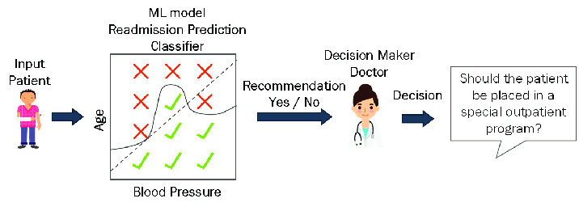
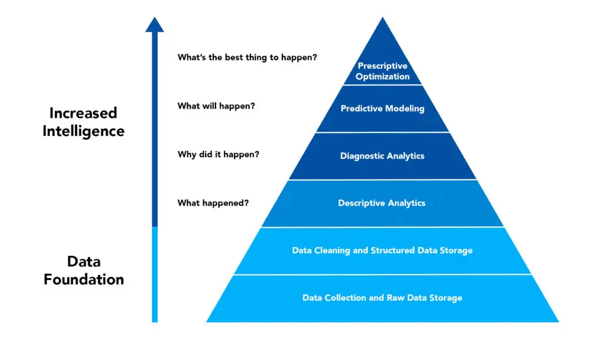
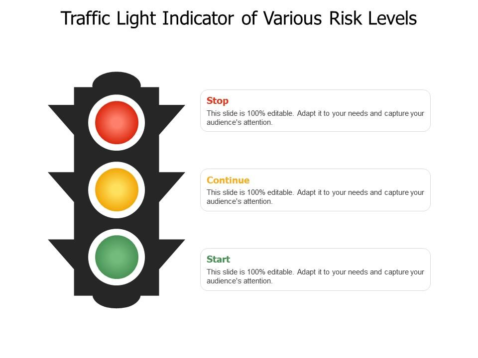
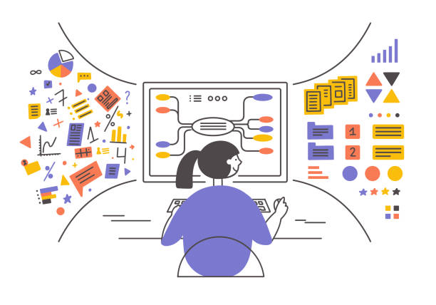
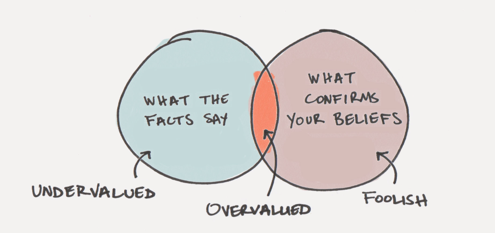
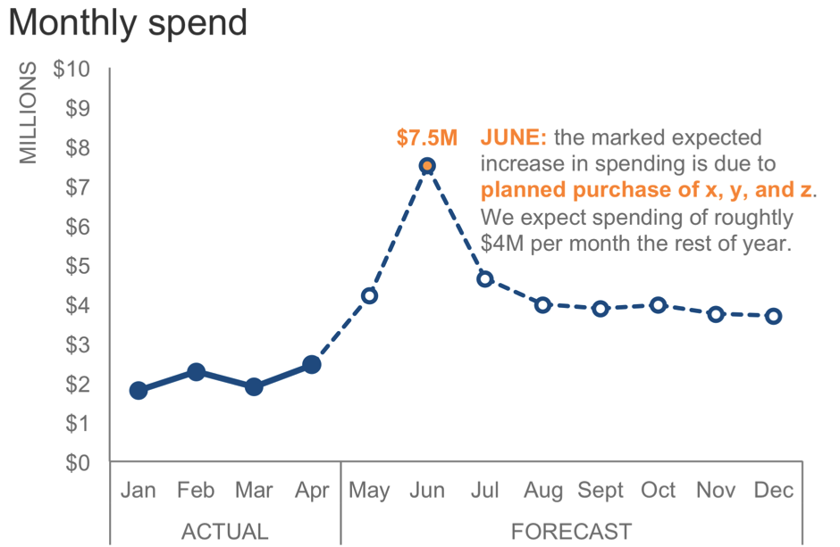
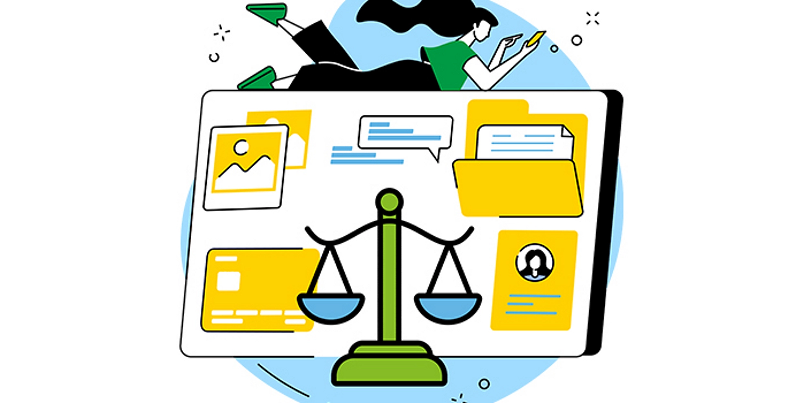

# Modelos Predictivos para la Toma de Decisiones Organizacionales

## INTRODUCCIÓN

En la semana anterior se abordaron los fundamentos de la toma de decisiones basadas en datos, destacando el rol de la evidencia como apoyo para reducir la incertidumbre y mejorar la calidad del análisis. En este contexto, los datos permiten comprender qué ha ocurrido y por qué, entregando insumos relevantes para la acción.

Sin embargo, muchas decisiones estratégicas no solo requieren entender el pasado, sino también **anticipar escenarios futuros**. Las organizaciones necesitan estimar riesgos, priorizar acciones y evaluar posibles consecuencias antes de que los eventos ocurran. Es en este punto donde los **modelos predictivos** adquieren un rol fundamental.

Los modelos predictivos permiten utilizar información histórica para **estimar probabilidades, tendencias o comportamientos futuros**, apoyando decisiones en contextos complejos y dinámicos. No reemplazan el juicio humano ni garantizan certezas absolutas, pero ofrecen una base analítica que fortalece la planificación, la gestión del riesgo y la asignación de recursos.

## 1. ¿QUÉ ES UN MODELO PREDICTIVO?

Un modelo predictivo es una herramienta analítica que utiliza datos históricos para identificar patrones y relaciones, con el objetivo de **estimar lo que podría ocurrir en el futuro**. A diferencia de los análisis descriptivos, que explican lo que ya sucedió, los modelos predictivos trabajan con escenarios posibles y niveles de incertidumbre.

Es importante destacar que un modelo predictivo **no produce verdades absolutas**, sino estimaciones basadas en la información disponible. Su valor radica en apoyar el análisis y orientar la toma de decisiones, no en automatizarla completamente.

Ejemplos de uso en organizaciones incluyen:

* Identificación de personas o procesos con mayor riesgo.
* Estimación de demanda futura de servicios.
* Priorización de casos que requieren intervención temprana.
* Detección de situaciones anómalas o excepcionales.

  

## 2. DEL ANÁLISIS DESCRIPTIVO AL ANÁLISIS PREDICTIVO

En la toma de decisiones basada en datos, es posible distinguir distintos niveles de análisis:

1. **Análisis descriptivo:** ¿Qué ocurrió?
2. **Análisis diagnóstico:** ¿Por qué ocurrió?
3. **Análisis predictivo:** ¿Qué podría ocurrir?
4. **Análisis prescriptivo:** ¿Qué acción conviene tomar?

Los modelos predictivos se sitúan en el tercer nivel. Su función principal es **anticipar escenarios**, permitiendo que la organización se prepare con antelación y reduzca la exposición al riesgo.

Por ejemplo, conocer cuántos casos presentan mayor probabilidad de ocurrencia permite priorizar esfuerzos, diseñar planes de acción y evaluar impactos potenciales antes de que los problemas se materialicen.

## 3. TIPOS DE PROBLEMAS PREDICTIVOS EN CONTEXTOS ORGANIZACIONALES

Desde una perspectiva conceptual, los modelos predictivos suelen abordar distintos tipos de problemas:

### 3.1 Clasificación

Permite asignar casos a categorías previamente definidas.

Ejemplos:

* Riesgo alto / riesgo bajo
* Probable abandono / permanencia
* Aprobación / rechazo

Este tipo de modelo es especialmente útil cuando las organizaciones necesitan **segmentar o priorizar**.

### 3.2 Regresión

Busca estimar valores numéricos continuos.

Ejemplos:

* Proyección de ventas
* Estimación de costos
* Predicción de demanda

### 3.3 Priorización y ranking

Ordena casos según su nivel de riesgo o relevancia.

Ejemplo:

* Listado de casos desde mayor a menor urgencia de intervención.

## 4. MODELOS PREDICTIVOS COMO APOYO A LA DECISIÓN

Uno de los aspectos más relevantes de este módulo es comprender que los modelos predictivos **no toman decisiones por sí mismos**. Su función es apoyar el análisis entregando información adicional que permita evaluar alternativas.

Una decisión organizacional responsable debe considerar:

* Resultados del modelo
* Contexto institucional
* Impactos humanos, sociales y económicos
* Criterio profesional de quienes deciden

Un error frecuente es delegar completamente la decisión en el modelo, sin cuestionar sus supuestos, limitaciones o posibles sesgos. Por el contrario, el uso estratégico de modelos implica **interpretar críticamente sus resultados**.

> **Frase clave:**
> *Un modelo no decide, sugiere escenarios.*

## 5. INCERTIDUMBRE, ERROR Y RIESGO EN LAS PREDICCIONES

Toda predicción conlleva un grado de error. Los modelos pueden equivocarse y es fundamental comprender **qué tipo de errores son más costosos para la organización**.

Algunas preguntas clave para el proceso decisional:

* ¿Qué ocurre si el modelo se equivoca?
* ¿Es más grave intervenir cuando no era necesario o no intervenir cuando sí lo era?
* ¿Qué impacto tiene el error en personas, recursos o reputación institucional?

Comprender estas dimensiones permite ajustar la forma en que se utilizan las predicciones y evitar decisiones automáticas o descontextualizadas.

## 6. INTERPRETACIÓN DE RESULTADOS PREDICTIVOS

Interpretar un modelo predictivo implica ir más allá del resultado final. Algunos aspectos clave son:

* Diferenciar probabilidad de certeza.
* Comprender que una predicción es una estimación condicionada por los datos disponibles.
* Analizar patrones generales más que casos individuales aislados.
* Comunicar resultados de forma clara y comprensible para distintos actores.

La capacidad de interpretación es especialmente relevante para líderes y tomadores de decisiones, quienes deben traducir los resultados técnicos en **acciones estratégicas concretas**.

## 7. LIMITACIONES Y USO RESPONSABLE DE LOS MODELOS

Los modelos predictivos presentan limitaciones que deben ser reconocidas:

* Dependencia de la calidad de los datos.
* Posibles sesgos históricos.
* Cambios en el contexto que invalidan patrones previos.
* Riesgo de sobreinterpretación de resultados.

El uso responsable de modelos implica reconocer estas limitaciones y combinarlos con una reflexión ética y organizacional, evitando decisiones que puedan generar efectos adversos no deseados.

## CONCLUSIONES

Los modelos predictivos constituyen una herramienta poderosa para apoyar la toma de decisiones en contextos organizacionales complejos. Al permitir anticipar escenarios futuros, contribuyen a reducir la incertidumbre, priorizar acciones y asignar recursos de manera más eficiente.

No obstante, su valor no reside únicamente en la capacidad técnica de generar predicciones, sino en la **interpretación crítica y contextualizada de sus resultados**. Los modelos deben ser entendidos como apoyos analíticos al servicio de la decisión humana, y no como mecanismos automáticos que reemplazan el juicio profesional.

Durante esta semana se ha enfatizado la importancia de comprender qué son los modelos predictivos, cómo se utilizan en distintos contextos organizacionales y cuáles son sus principales limitaciones. Este conocimiento sienta las bases para, en etapas posteriores, analizar el rol de la inteligencia artificial y la automatización en procesos decisionales más avanzados, siempre desde una perspectiva ética, responsable y estratégica.

## BIBLIOGRAFÍA BASE

* Provost, F., & Fawcett, T. (2013). *Data Science for Business*. O’Reilly Media.

  > Referencia clave para comprender el valor estratégico de los modelos predictivos.

* Davenport, T. H. (2014). *Big Data at Work*. Harvard Business Review Press.

  > Enfoque aplicado al uso de analítica en decisiones organizacionales.

* Shmueli, G., Bruce, P., Yahav, I., Patel, N., & Lichtendahl, K. (2020). *Data Mining for Business Analytics*. Wiley.

  > Marco conceptual sobre predicción y toma de decisiones.

* OECD. (2020). *Artificial Intelligence in Society*. OECD Publishing.

  > Discusión sobre riesgos, beneficios y uso responsable de modelos predictivos.

* Ministerio de Ciencia, Tecnología, Conocimiento e Innovación de Chile. (2021). *Política Nacional de Inteligencia Artificial*.

  > Contexto nacional para el uso responsable de IA y analítica.

