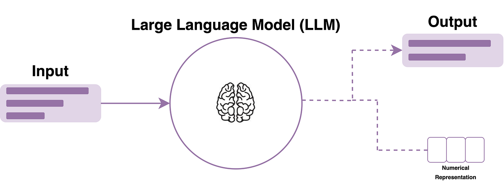
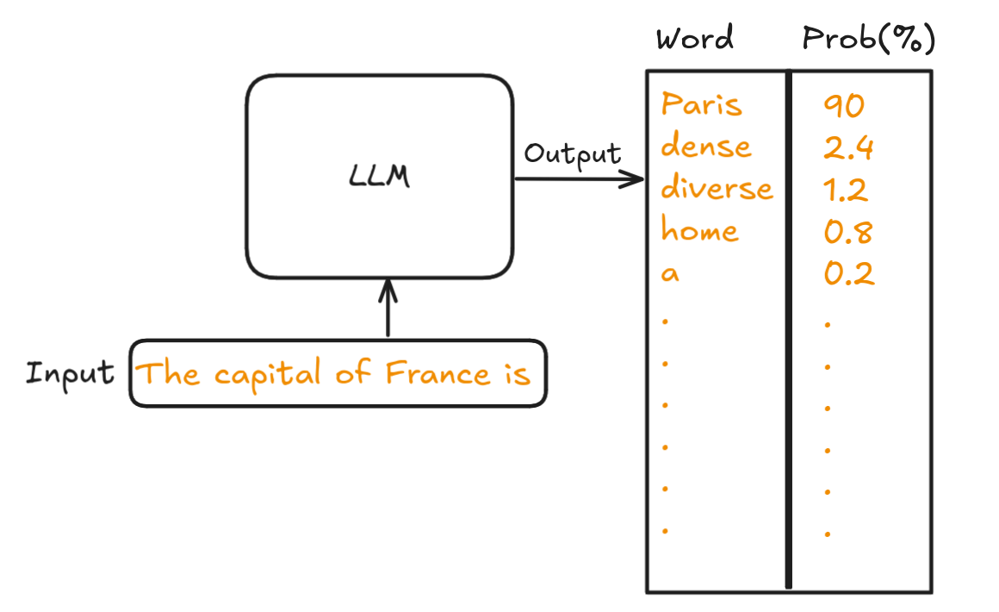
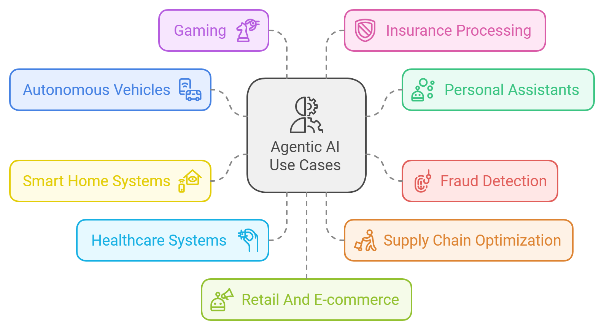
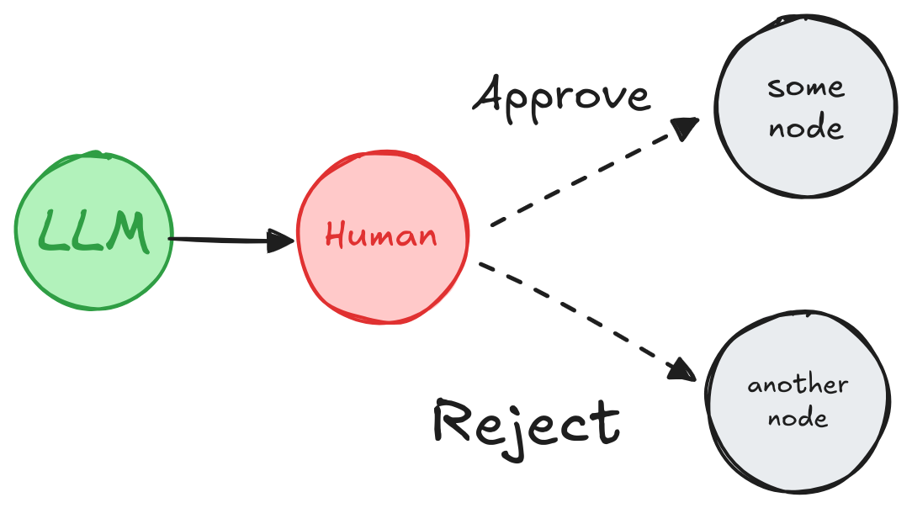
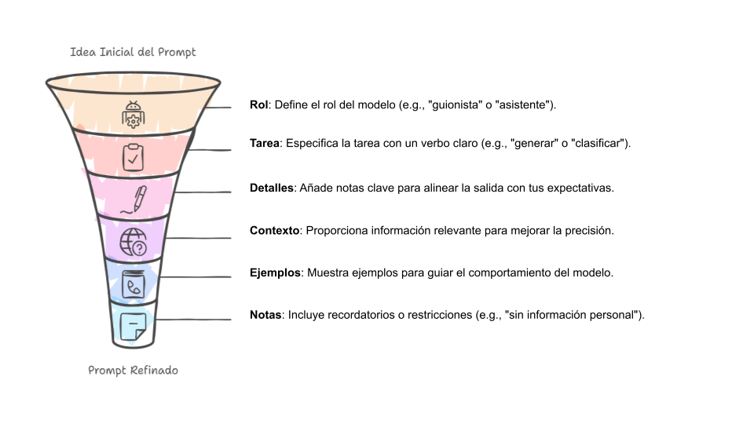
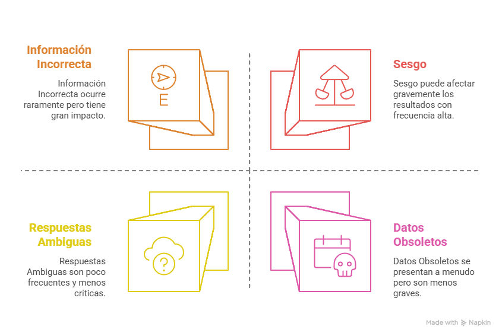

# Inteligencia Artificial en la Toma de Decisiones

## Alcances, límites y uso responsable

## INTRODUCCIÓN

En las semanas anteriores se abordaron los fundamentos de la toma de decisiones basadas en datos y el rol de los modelos predictivos como herramientas para anticipar escenarios futuros. En ambos casos, se enfatizó que los datos y los modelos **no reemplazan la decisión humana**, sino que la apoyan.

En esta tercera semana, el foco se desplaza hacia la **inteligencia artificial (IA)**, particularmente hacia los **modelos de lenguaje y asistentes inteligentes**, que hoy se integran crecientemente en procesos organizacionales, educativos y productivos. Estas tecnologías permiten automatizar tareas, generar contenido, apoyar análisis y facilitar la interacción humano–máquina.

Sin embargo, su uso plantea nuevos desafíos: **¿qué tan confiables son?, ¿qué pueden y qué no pueden hacer?, ¿qué riesgos implican?, ¿cuándo es apropiado usarlas en decisiones organizacionales?**
Responder estas preguntas es clave para una adopción responsable y estratégica de la IA.

> **Imagen sugerida:**
> Ilustración de una persona interactuando con un asistente de IA, con un humano supervisando el proceso.

## 1. ¿QUÉ ES (Y QUÉ NO ES) LA INTELIGENCIA ARTIFICIAL?

En el contexto actual, gran parte de las aplicaciones de IA utilizadas en organizaciones corresponden a **modelos de lenguaje de gran escala (LLM)**, como los que dan origen a asistentes virtuales tipo ChatGPT, Gemini o Meta AI .

Estos modelos:

* Se entrenan con grandes volúmenes de texto.
* Aprenden patrones del lenguaje.
* Generan respuestas **prediciendo palabra por palabra**, sin comprender realmente el contenido.

Es fundamental aclarar que:

* Los modelos **no razonan como humanos**.
* No tienen conciencia ni intención.
* No distinguen verdad de falsedad por sí mismos.

> **Mensaje clave:**
> *La IA no “entiende”: predice patrones.*

 

 

## 2. ASISTENTES VIRTUALES EN CONTEXTOS ORGANIZACIONALES

Los asistentes virtuales basados en IA permiten interactuar en lenguaje natural y se utilizan hoy en múltiples ámbitos :

* Educación: apoyo tutorial
* Atención a clientes: respuestas automáticas
* Gestión: redacción, resumen y análisis
* Software: generación y explicación de código
* Comunicación interna: apoyo documental

Desde la toma de decisiones, estos asistentes **no deciden**, pero:

* Entregan información
* Generan alternativas
* Apoyan la reflexión
* Aceleran procesos cognitivos

El valor organizacional está en **cómo se integran**, no en la tecnología en sí.

## 3. DECISIONES ASISTIDAS VS DECISIONES AUTOMATIZADAS

Uno de los conceptos centrales de esta semana es distinguir entre dos enfoques:

### Decisiones asistidas por IA

* La IA entrega recomendaciones o información.
* El humano evalúa y decide.
* Existe supervisión y responsabilidad clara.

### Decisiones automatizadas

* El sistema ejecuta la decisión sin intervención humana.
* Mayor riesgo ético, legal y reputacional.
* Requiere marcos de gobernanza estrictos.

En contextos organizacionales, **no toda decisión debe automatizarse**, especialmente aquellas con alto impacto humano.

> **Frase clave:**
> *Que algo pueda automatizarse no significa que deba automatizarse.*

## 4. PROMPTS: CÓMO INTERACTUAMOS CON LA IA

Los **prompts** son las instrucciones que se entregan a un modelo de lenguaje para guiar su respuesta .
Un buen prompt **no es magia**, sino diseño consciente.

Elementos clave de un buen prompt:

* Rol del modelo
* Tarea clara
* Contexto relevante
* Detalles y restricciones
* Ejemplos cuando sea necesario

En términos decisionales, esto implica que:

* La calidad de la salida depende de la calidad de la instrucción.
* Resultados pobres no siempre implican “mala IA”, sino **mal planteamiento del problema**.

## 5. PROBLEMAS COMUNES DE LOS MODELOS DE LENGUAJE

Según lo expuesto en el material base, los LLM presentan limitaciones recurrentes :

* Información incorrecta o inventada
* Respuestas ambiguas
* Sesgos heredados de los datos
* Uso de información obsoleta

Desde la toma de decisiones, esto implica que:

* No toda respuesta debe tomarse como válida.
* Es necesario verificar información crítica.
* El juicio humano sigue siendo indispensable.

## 6. SESGOS Y RIESGOS EN EL USO DE IA

La IA aprende de datos históricos, y esos datos pueden contener:

* Sesgos sociales
* Desigualdades estructurales
* Decisiones pasadas injustas

Al utilizar IA en decisiones organizacionales, existe el riesgo de:

* Reproducir discriminación
* Amplificar inequidades
* Ocultar decisiones injustas bajo una apariencia técnica

> **Mensaje clave:**
> *La IA no elimina sesgos: puede amplificarlos.*

## 7. EXPLICABILIDAD Y TRANSPARENCIA

Para una toma de decisiones responsable, es fundamental preguntarse:

* ¿Podemos explicar por qué el sistema entregó esta respuesta?
* ¿Podemos justificar la decisión frente a terceros?
* ¿Quién asume la responsabilidad final?

La explicabilidad:

* Aumenta la confianza
* Facilita la rendición de cuentas
* Protege a la organización

Un sistema útil no solo debe funcionar, sino **poder explicarse**.

> **Imagen sugerida:**
> Caja negra vs caja transparente.

## 8. ÉTICA Y USO RESPONSABLE DE LA IA

El uso organizacional de la IA debe regirse por principios éticos claros :

* Responsabilidad
* Transparencia
* Justicia
* Supervisión humana
* Protección de datos

La ética no es un obstáculo, sino un **marco de confianza** que permite un uso sostenible de la tecnología.

## 9. ¿CUÁNDO NO USAR IA?

Tan importante como saber usar IA es saber **cuándo no hacerlo**:

* Cuando no se puede explicar el resultado
* Cuando los datos son insuficientes o sesgados
* Cuando el impacto humano es alto
* Cuando no hay responsables claros

Decidir **no usar IA** también es una decisión estratégica válida.

## CONCLUSIONES

La inteligencia artificial ofrece un enorme potencial para apoyar la toma de decisiones organizacionales, especialmente a través de asistentes inteligentes y modelos de lenguaje. Sin embargo, su uso requiere comprensión, criterio y responsabilidad.

A lo largo de esta semana se ha enfatizado que la IA **no es magia**, sino una herramienta basada en patrones, datos y diseño humano. Su valor no está en reemplazar al decisor, sino en ampliar su capacidad de análisis y reflexión.

El desafío para las organizaciones no es adoptar IA sin límites, sino **integrarla de forma ética, explicable y alineada con sus valores y objetivos estratégicos**.

## BIBLIOGRAFÍA BASE

* Canales, V. (2025). *No es Magia, es Ciencia: Cómo conversar mejor con asistentes de IA*. Seth&Nut. 
* OECD. (2020). *Artificial Intelligence in Society*. OECD Publishing.
* Floridi, L. et al. (2018). *AI4People—An Ethical Framework for a Good AI Society*.
* Davenport, T. H. (2018). *The AI Advantage*. MIT Press.

