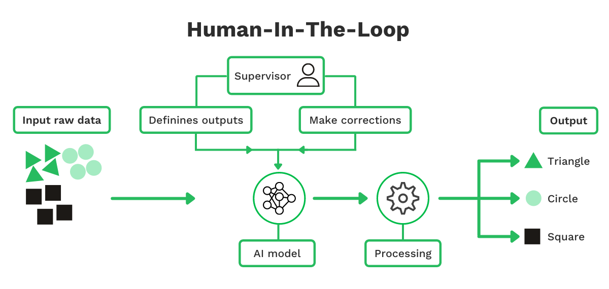
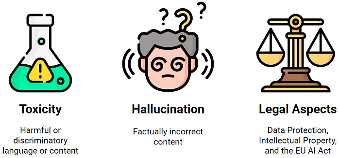
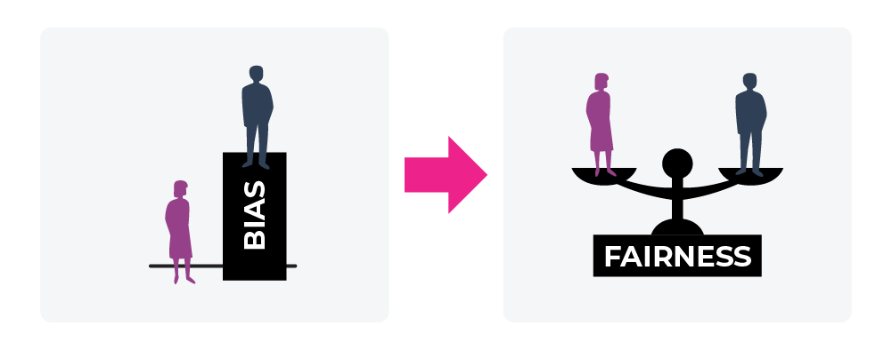
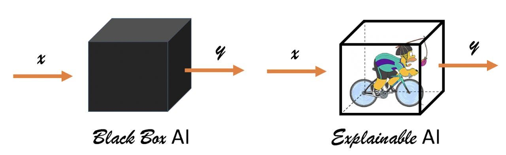

# Inteligencia Artificial en la Toma de Decisiones

## Alcances, límites y uso responsable

---

## INTRODUCCIÓN

En las semanas anteriores se abordaron los fundamentos de la **toma de decisiones basadas en datos** y el rol de los **modelos predictivos** como herramientas para anticipar escenarios futuros. En ambos casos se enfatizó una idea central: los datos y los modelos **no reemplazan la decisión humana**, sino que la apoyan proporcionando información adicional para el análisis.

En esta tercera semana el foco se desplaza hacia la **inteligencia artificial (IA)**, particularmente hacia los **modelos de lenguaje y asistentes inteligentes**, tecnologías que hoy se integran cada vez con mayor frecuencia en procesos organizacionales, educativos y productivos.

Estas herramientas permiten:

- automatizar ciertas tareas cognitivas
- generar y sintetizar información
- apoyar procesos de análisis
- facilitar la interacción entre personas y sistemas digitales

Sin embargo, su creciente uso también plantea nuevos desafíos:

- ¿Qué tan confiables son estos sistemas?
- ¿Qué pueden y qué no pueden hacer?
- ¿Qué riesgos implica su uso?
- ¿En qué situaciones es apropiado utilizarlos en procesos de decisión?

Responder estas preguntas es fundamental para que las organizaciones puedan **adoptar la inteligencia artificial de manera responsable, estratégica y consciente de sus límites**.

Además, es importante comprender que la inteligencia artificial no es una única tecnología. Bajo este término se agrupan distintos tipos de sistemas capaces de **identificar patrones en datos y producir resultados automatizados**, entre ellos:

- modelos predictivos
- sistemas de recomendación
- sistemas de detección de anomalías
- visión computacional
- modelos de lenguaje

En esta semana nos centraremos especialmente en **modelos de lenguaje y asistentes inteligentes**, ya que son las herramientas que actualmente se integran con mayor rapidez en el trabajo cotidiano.

## 1. ¿QUÉ ES (Y QUÉ NO ES) LA INTELIGENCIA ARTIFICIAL?

La inteligencia artificial es un campo amplio que incluye tecnologías capaces de **aprender patrones a partir de datos y generar resultados basados en esos patrones**.

En el contexto actual, muchas de las aplicaciones más visibles corresponden a **modelos de lenguaje de gran escala (Large Language Models, LLM)**, que dan origen a asistentes virtuales como ChatGPT, Gemini o Meta AI.

Estos modelos funcionan mediante tres principios fundamentales:

- Se entrenan con **grandes volúmenes de texto** provenientes de múltiples fuentes.
- Aprenden **patrones estadísticos del lenguaje**.
- Generan respuestas **prediciendo la siguiente palabra más probable en una secuencia**.

Esto significa que los modelos de lenguaje producen texto que **parece coherente y razonado**, pero en realidad se basa en cálculos probabilísticos sobre secuencias de palabras.

Por esta razón es importante comprender que:

- Los modelos **no razonan como humanos**.
- No poseen conciencia ni intención.
- No distinguen por sí mismos entre información verdadera o falsa.
- No tienen comprensión real del contenido que generan.

Esto no implica que sean inútiles. Por el contrario, pueden ser herramientas muy poderosas cuando se utilizan con criterio y comprensión de sus limitaciones.

> **Mensaje clave**  
> *La IA no “entiende”: identifica y reproduce patrones.*

---

## 2. ASISTENTES VIRTUALES EN CONTEXTOS ORGANIZACIONALES

Los asistentes virtuales basados en IA permiten interactuar con sistemas informáticos utilizando **lenguaje natural**, lo que reduce las barreras técnicas para su uso.

Actualmente se utilizan en múltiples contextos organizacionales.

### Educación

- apoyo tutorial
- explicación de contenidos
- generación de material educativo

### Atención a clientes

- respuestas automáticas
- resolución de consultas frecuentes
- apoyo a agentes humanos

### Gestión organizacional

- redacción de documentos
- síntesis de información
- análisis preliminar de textos

### Desarrollo de software

- generación de código
- explicación de errores
- apoyo a tareas de programación

### Comunicación interna

- organización de información
- elaboración de reportes
- asistencia documental

Desde la perspectiva de la toma de decisiones, estos sistemas **no toman decisiones por sí mismos**, pero pueden:

- entregar información relevante
- generar alternativas de análisis
- resumir escenarios complejos
- acelerar procesos de revisión de información

El verdadero valor organizacional no está únicamente en la tecnología, sino en **cómo se integra en los procesos de trabajo y decisión**.

Una organización que incorpora IA sin adaptar sus procesos difícilmente obtendrá beneficios significativos.

> **Idea clave**  
> El valor de la IA no está solo en la herramienta, sino en **cómo se integra en los procesos organizacionales**.

## 3. DECISIONES ASISTIDAS VS DECISIONES AUTOMATIZADAS

Uno de los conceptos centrales para comprender el uso de IA en organizaciones es distinguir entre **decisiones asistidas** y **decisiones automatizadas**.

### Decisiones asistidas por IA

En este enfoque, la inteligencia artificial funciona como **herramienta de apoyo**.

- La IA entrega información o recomendaciones.
- El humano evalúa los resultados.
- La decisión final sigue siendo responsabilidad de la persona.

Este modelo es el más común en contextos organizacionales donde se requiere **criterio profesional, responsabilidad institucional o evaluación contextual**.

### Decisiones automatizadas

En este caso, el sistema **ejecuta directamente la decisión** sin intervención humana.

Ejemplos posibles incluyen:

- aprobación automática de transacciones
- sistemas de detección de fraude
- sistemas de asignación automática de recursos

Este tipo de sistemas puede ser eficiente, pero también implica mayores riesgos:

- errores automatizados
- dificultad para explicar decisiones
- problemas legales o reputacionales

Por esta razón, **no toda decisión debe automatizarse**, especialmente aquellas que tienen alto impacto sobre las personas.

> **Frase clave**  
> *Que algo pueda automatizarse no significa que deba automatizarse.*

---

## 4. PROMPTS: CÓMO INTERACTUAMOS CON LA IA

Los **prompts** son las instrucciones o preguntas que se entregan a un modelo de lenguaje para orientar su respuesta.

La interacción con estos sistemas depende en gran medida de **cómo se formula la solicitud**. Un buen prompt no es un truco técnico, sino una forma clara de **definir un problema o una tarea**.

Un prompt efectivo suele incluir:

- **Rol del modelo**  
  (por ejemplo: “actúa como analista de datos”)

- **Tarea clara**  
  (qué se espera que haga)

- **Contexto relevante**  
  (información necesaria para comprender el problema)

- **Restricciones o criterios específicos**

- **Ejemplos cuando sea necesario**

En términos decisionales, esto implica que:

- La calidad de la respuesta depende en gran medida de la **calidad de la pregunta**.
- Resultados deficientes no siempre reflejan fallas de la IA, sino **problemas en la formulación del problema**.

Aprender a utilizar asistentes de IA implica, en muchos casos, **aprender a definir mejor las preguntas y problemas que se quieren resolver**.

## 5. PROBLEMAS COMUNES DE LOS MODELOS DE LENGUAJE

Aunque los modelos de lenguaje pueden generar respuestas útiles, también presentan limitaciones importantes.

Entre los problemas más frecuentes se encuentran:

- **Información incorrecta o inventada**  
- **Respuestas ambiguas o poco precisas**
- **Sesgos presentes en los datos de entrenamiento**
- **Uso de información desactualizada**

Este fenómeno se conoce a veces como **alucinaciones de la IA**, cuando el modelo produce información que parece plausible pero no es correcta.

Desde la perspectiva de la toma de decisiones, esto implica que:

- No toda respuesta generada por IA debe considerarse correcta.
- La información crítica debe **verificarse con fuentes confiables**.
- El juicio humano sigue siendo indispensable para evaluar resultados.

> **Idea clave**  
> La IA puede ser un buen punto de partida para el análisis, pero **no debe ser la única fuente de decisión**.

## 6. SESGOS Y RIESGOS EN EL USO DE IA

La inteligencia artificial aprende a partir de **datos históricos**. Si esos datos contienen sesgos o desigualdades, el sistema puede reproducirlos.

Entre los posibles problemas se encuentran:

- sesgos sociales presentes en los datos
- desigualdades estructurales reflejadas en información histórica
- decisiones pasadas que pudieron haber sido injustas

Cuando estos datos se utilizan para entrenar sistemas de IA, existe el riesgo de:

- reproducir discriminación
- amplificar desigualdades
- ocultar decisiones problemáticas bajo una apariencia técnica.

> **Mensaje clave**  
> *La IA no elimina sesgos: puede amplificarlos.*

Por esta razón, las organizaciones deben evaluar cuidadosamente **qué datos utilizan y cómo interpretan los resultados generados por los sistemas de IA**.

---

## 7. EXPLICABILIDAD Y TRANSPARENCIA

Para utilizar IA en procesos de decisión responsables es fundamental considerar la **explicabilidad** de los sistemas.

Esto implica poder responder preguntas como:

- ¿Por qué el sistema generó esta recomendación?
- ¿Podemos explicar la decisión frente a terceros?
- ¿Quién asume la responsabilidad final?

La explicabilidad cumple varias funciones importantes:

- aumenta la confianza en los sistemas
- facilita la rendición de cuentas
- protege a las organizaciones frente a riesgos legales o reputacionales.

Un sistema útil no solo debe producir resultados, sino también **permitir comprender cómo se llegó a ellos**.

## 8. ÉTICA Y USO RESPONSABLE DE LA IA

El uso organizacional de la inteligencia artificial debe guiarse por principios éticos claros.

Entre los más relevantes se encuentran:

- **Responsabilidad**
- **Transparencia**
- **Justicia y no discriminación**
- **Supervisión humana**
- **Protección de datos**

La ética no debe entenderse como un obstáculo para la innovación, sino como un **marco de confianza que permite utilizar la tecnología de manera sostenible y responsable**.

Las organizaciones que integran estos principios en sus procesos suelen desarrollar **mayor legitimidad, confianza y estabilidad en el uso de tecnologías emergentes**.

## 9. ¿CUÁNDO NO USAR IA?

Tan importante como saber utilizar la inteligencia artificial es reconocer **cuándo no es apropiado utilizarla**.

Algunas situaciones donde se recomienda cautela incluyen:

- cuando no es posible explicar el resultado del sistema
- cuando los datos disponibles son insuficientes o sesgados
- cuando el impacto humano de la decisión es muy alto
- cuando no existe una responsabilidad clara sobre el proceso decisional.

En estos casos, **decidir no utilizar IA puede ser una decisión estratégica correcta**.

## 10. GUÍA BREVE DE IMPLEMENTACIÓN RESPONSABLE DE IA

Para integrar inteligencia artificial en una organización de forma segura y efectiva, se recomienda considerar los siguientes pasos:

1. Identificar tareas adecuadas para IA (preferentemente de bajo o medio impacto).
2. Mantener supervisión humana en decisiones críticas.
3. Establecer mecanismos de verificación de resultados.
4. Proteger datos sensibles y limitar la información compartida con sistemas externos.
5. Documentar prompts, decisiones y responsables.
6. Revisar periódicamente posibles sesgos o efectos no deseados.

Aplicar estas prácticas permite **reducir riesgos operativos, éticos y reputacionales**, facilitando una adopción más segura de estas tecnologías.

---

## CONCLUSIONES

La inteligencia artificial ofrece un enorme potencial para apoyar la toma de decisiones organizacionales, especialmente a través de asistentes inteligentes y modelos de lenguaje.

Sin embargo, su uso requiere comprensión, criterio y responsabilidad. Estas herramientas no sustituyen el juicio humano, sino que amplían las capacidades de análisis, síntesis y exploración de información.

A lo largo de esta semana se ha enfatizado que la IA **no es magia**, sino una tecnología basada en datos, patrones y diseño humano.

El verdadero desafío para las organizaciones no es simplemente adoptar inteligencia artificial, sino **integrarla de forma ética, explicable y alineada con sus objetivos estratégicos**.

---

## BIBLIOGRAFÍA BASE

* OECD. (2020). *Artificial Intelligence in Society*. OECD Publishing.

  > Discusión sobre riesgos, beneficios y uso responsable de la IA en la sociedad.

* Floridi, L. et al. (2018). *AI4People—An Ethical Framework for a Good AI Society*.

  > Marco ético para diseñar e implementar IA centrada en el bien común.

* Davenport, T. H. (2018). *The AI Advantage*. MIT Press.

  > Enfoque práctico sobre cómo aplicar IA para generar valor en organizaciones.